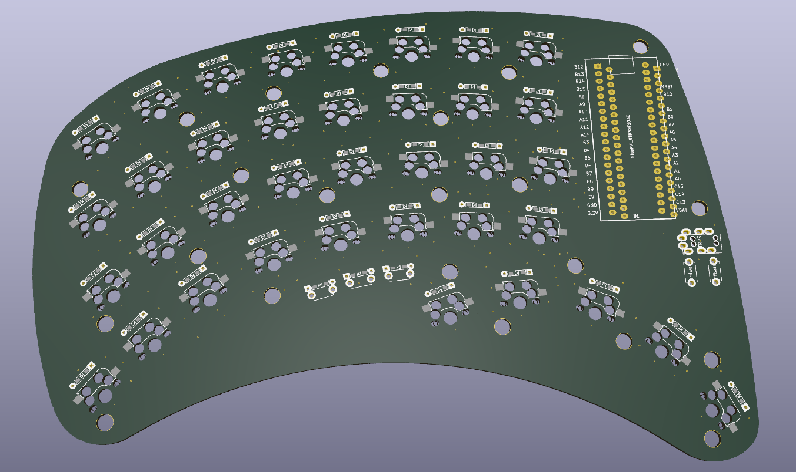
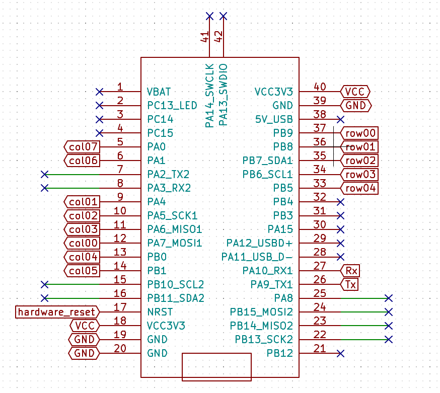
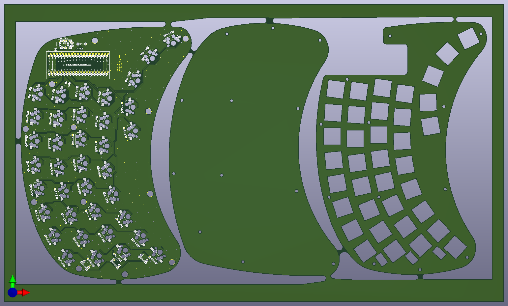
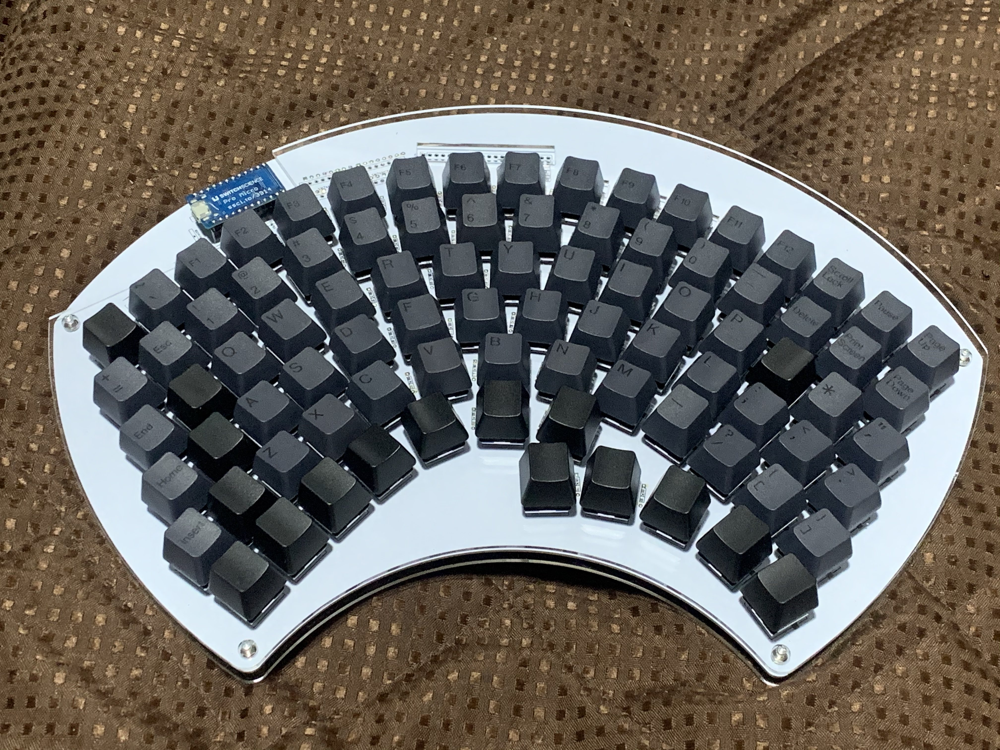

# fennel
T
fan90のPCB、アクリルケースの発注が終わった。暇。この間に次のキーボードを作る。  
とりあえず名前はそのまま引き継ぐ。古いものは別ブランチに残す。別リポジトリにするかも...

## コンセプト

両手用左右分離型キーボード。fan90を小さくした。 片手に37キーの予定。  
ただしキーマトリクスが余る分を小さなリセットスイッチなどで設け、  
あまり使用頻度が高くない機能を割り当てる(マイコンの設定など)。  

* 指に合わせていい感じにキーが配置されてる両手で使えるキーボード欲しい。fan90二つはちょっと...
* fan90は流行に逆らったマキシマムな設計だったので、次は長いものに巻かれる小さ目な設計にする。
* 基盤はfan90と同じように両面対応する。
* fan90では筋力的にできなかった左右分割のキーボードにする。（左右間で通信する）
* ~~ケースはできれば3Dプリンターを使ってみる。~~ 基盤でケース作る方向にした。
* fan90のねじ数が少なくてちょっとたわむのでねじを増やす。
* Pro MicroではなくBluePillを使ってみる。

外形が難しい... \_(:3 」∠ )\_

## 設計

fan90に比べ、
* 左右分離(通信)
* BluePillを使う(ARM)
の2点により難易度が上昇している。
というか参考にできる情報がすくない。

現状回路がよくなさそうなので長い目で決めていく。

* UART半二重通信をする予定
	* 
	* 右手のbluepillはスキャンしてひたすら左手に送信するだけ
	* 左手は受け取って左手のスキャン情報と合わせてPCにUSB経由で送信
	* 通信用の信号線(回路図のdata)はpullupしつつ、GNDとツェナーダイオードでつなぐ。
* pullup抵抗を入れる
	* 10kΩが多いみたい。
	* 1.5kΩの抵抗が余ってるからこれでもいいかな...
	* wikipediaによるとバイポーラは1kΩ～4.7kΩ、CMOSでは220kΩ～1MΩらしい
	* データシートにweak pull-up equivalent resistorの記述があるので、  
	内蔵のプルアップ抵抗も使えるみたい。VINとVSSをつなぐと30～50kΩになるみたい。(43ページ)
* RX は入力端子なので保護抵抗を入れる。
	* これも1.5kΩでいいかな...
	* データシートにたしかに10kΩ書いてあるので10kΩにした方がよさそう
* 使ってないIOピンもVCCかGNDに10kΩ挟んでつなぐ
	* どっちでもいいみたい
	* これは外部でプルアップ/ダウンする必要があるみたい
	> All unused pins must be held at a fixed voltage, by using the I/O output mode, an external pull-up or pull-down resistor
* キーマトリクスに割り当てるピン配置を変える

* 異種面付けをしてみた
	
	* お値段 5枚製造
		* 異種面付けで基板製造の費用$93
		* 異種面付けしないで３枚頼んだ時の基板製造費$33
	* かすかに安いが、後加工が必要になるので、その点で普通に注文したほうよい。

### STM32F103について

調べて分かったことのメモ。間違っているかも。

* 内部回路の電源が分かれている。
	* VBAT はRTCとか用
		* ボタン電池とかをつないでRTCを維持できるみたい。
	* 1.8Vはコア回路用
	* VDDはデジタル回路用
	* VDDAはアナログ回路用

* リセットは3種類ある
	1. 電源を切る
	1. NRSTをGNDにつなぐ
	1. backup領域のみリセットする(そもそもbackup領域とは..)
		* BDRSTレジスタでリセット
		* VDDがONでリセット
		* VBATがONでリセット

* ピンについて
	* PA9がTx、PA10がRx。
	* PA15、PB3、PB4はJRAGデバッグに使われている(JTAGデバッグとは...)ので使おうとするとひと手間いる。
	* PB2はジャンパにつながっている。
	* PA11、PA12はUSB端子につながっている。
	* generic bootloader向け
		* bootloaderの種類はbluepillの実装に合わせる。generic_boot20_xxx.binのxxxはLEDのpinに合わせる。
			* 合わせることでDFUモードの状態をLEDで表示できる。
		* PA12はUSBリセットに使われているので、外部HWをつながない方がよい。
		* PC13はDFUの状態をLEDで表示するのに使われているので、外部HWをつながない方がよい。
		* PC14はNRSTに使われているので、外部HWをつながない方がよい。
			* PC14を3.3VにプルアップするとDFU永続モードになる？
			* DFU永続モードにできるなら有用なので専用回路を実装したい。
			* PC14をhigh→リセット→書き込み→PC14を開放→リセットの流れっぽい。

* 書き込みについて
	* USB経由での書き込みはタイミングよくリセットボタンを押す必要があるらしい。
		* 「Arduinoの書き込みを押した後0.5秒後くらいにボードのリセットを押す」らしい...

## リンク集

* 一番詳しかった  
ＤＥＫＯのアヤシいお部屋。 - STM32F103 https://ht-deko.com/arduino/stm32f103c8t6.html

* DFUモードの0.5秒の情報はここ  
adfmac/bluepill-arduino.md https://gist.github.com/tadfmac/f1dffc8c674ddaa8bd2340a8ddec65be

## ケース

基板と一緒に頼んだ。

## 回路間違っていた。
頼んだタイミングが残業で疲れた深夜だったため、いろいろミスった状態で発注した\_(:3 」∠ )\_
労働は体に良くない。

とりあえずゴリゴリ基盤を削って空中配線してごまかした。

## ファームウェア

[Ortho 75](https://github.com/qmk/qmk_firmware/tree/master/keyboards/cannonkeys/ortho75)を参考にする。

とりあえずこぴっていじる

<!--{{{-->

## 以下古いバージョン

v1 fan90 片手用フルキーボード

## one hand keyboard fan90

片手用キーボードです。G13のような用途を想定しています。  
左手で使うことを想定していますが、右手でも使えるようにPCBは作っています。  
流行りのミニマムなキーボードとは反対方向のマキシマムな方向のキーボードです。  
両手で使うことを想定していませんが、両面対応しているので2つ用意すれば可能です。  

初めての自作キーボードなので楽しみなのと不安なのが混在しています\_(:3 」∠ )\_
あくまで初めてつくる自作キーボードであるため、当然ながら動かない可能性が高いです。

開発経緯

### キーボード割ろうとしたら曲がった
* ありものは素晴らしい、でも自分で作ってみたい。よし、初めてのキーボード自作だ！PCBから作るぞ\\('ω')/
* 今使ってるhelixよい。でもErgodox的な縦のずれがあるキーボードもよさそう。そういうの作ろう...
* 左右分割型のキーボード良い。割りたい！でも左右の通信とかどうやってるんだろう...ちゃんと作れるかな...
* とりあえずキーを並べてみる。小指とか根元に近く配置しよう...
* 見た目汚いな...とりあえずきれいに並べてみるか...あれ、なんか曲がってきた...
* あれこれ片手でフルキーボードいけるんじゃ...

という感じでした\_(:3 」∠ )\_  
つまりキーボードを割ろうとしたが、  
筋力が足りなかったため（左右に分割したときの左右間の通信を電源(VCC,GND)と信号線の3本でどうやって通信してるのかわからなかったので）、  
割れずに曲がってしまった。  
次作るときは割りたい。  
名前は見た目がうちわのようになったため。  もちろん余った基板は重めの団扇として使うことができる。
鍋敷きにしてもよい。

構想

#### コンセプト
以下で東西南北を言うときは、左手で中指の方向を北とした場合の手のひらからの方向を指します。

* 片手でたくさんのキーを使える。
	* フルキーボード相当のキーを使えるものとする。
		* 現状6x15のマトリクスで87キーを配置。
		* 残り３キーはあまり使わない用途向けにリセットスイッチ部品で配置。

* 片手で使いやすい。
	* 指毎の特徴に合わせて配置する。  
		例えば
		* 親指はゲームのコントローラーで多用されるように本来非常に性能が良い。  
		しかしキーボードを使う上で親指を生かすのは難しい。  
		Twitterの投票によると親指に複数のキーを割り当てているときに使っているキーの数はせいぜい4キーらしい。  
		このキーボードでは多めに5キーを割り当てる。
		* 人差し指は性能が良くQWERTYでもほかの指より多いキーを担当する。  
		このキーボードでも人差し指の担当は多くする。
		* 中指は人差し指と同じくらいのせいのがある。中指にも多めのキーを割り当てる。
		* 薬指は中指と一緒に動かないと性能が良くないので、キーボードではあまり性能を発揮できない。
		ただし、北西方向は強く、北西方向に関しては小指より適している。。
		* 小指は短いので、北西方向の移動は難しい。  
		しかし西方向、南西方向はそこそこ性能が良い。
	* 指に合わせてキーを配置する。
		* 変則的な配置なので指１本に対して割り当てられたキーの数は様々。
			* 現状小指20、薬指15、中指12、人差し指31、親指5キー。人差し指と小指は無駄キーを含む。足しても90にはならない。
		* 将来的にはキーを立体的に配置するのもよいが、現状は平面に配置。
	* 指は伸ばした状態のほうが押しやすく、キーを押し分けやすい。
		* 指の根本に近いキーよりも指を伸ばしたときに押すキーのほうが押しやすい。
		* 指の根元に近いキーを減らし、指を伸ばしたときに押すキーを増やす。
	* レイヤーは極力つかわない。
		* シフトキーのように押しながら操作することは片手だと難しい。

* すべてのキーを常に使うキーにはせず、使う用途に合わせてカスタマイズできるよう、無駄にキーを配置する。

#### 実現方法

* 以下の2点からキーを扇状に配置する。
	* 小指の性能を発揮できるように小指のキーは手首側に寄せる。
	* 伸ばした状態で使える人差し指、中指のキーを増やす。
* 列方向には揃えず、行方向にはそろえる。
* 無駄にキーを小指の西側、人差し指の東側、すべての指の北側に配置する。つまり一回り大きくする。

#### 将来的にやりたいこと

* QMKを使わずに作る。(現状使う)
* C以外の言語で作る。(現状C言語)
* マイコンを複数種類使えるようにする。(現状むずかしい)
* raspberry pi zeroと画面を搭載して、それ単体でPCとして動作させ多機能にする。(現状ソケットのみ用意)
* ケースを3Dプリンターなどでつくる。
* キーを立体的に配置する。

### PCB設計

kicadを使って設計した。

回路は6x15のマトリクス。column方向からスキャンし、rowを検出する。  
column方向のスキャンは床に転がっていたSN74HC595を使う。  
シフトレジスタを使えば簡単にスキャンできそう。  
これで信号線数を15-5で10本減らせることになる。  
pro microはデジタルIOピンが14本、デジタルとしても使えるアナログIOピンが4本なので、
最大18本をデジタルIOとして使うことができる。
6本をrowのデジタル入力に、5本をシフトレジスタへのデジタル出力に、
2本をリセットスイッチに使用することにした。
配置は特にこだわりなく並べた。このせいで後々苦労するかもしれないがまあ初めてなので良しとする。

### アクリルケース設計

* ケースもとりあえずアクリルで作ることにした。
* ケースもDXFで入稿できるみたいなのでkicadでそのまま作った。
	* SVGでもよさそうだがそもそもSVGで線幅を狭くするとinkscapeやchromeで表示したとき線が描画されない問題があった。
* アクリルは[工房Emerge+](https://www.emergeplus.jp/laser-cutting-service/)を使ってみることにした。
	* elecrowはウェブサイトの調子が良くないのか、そもそもサービス中止中なのか、  
	https://twitter.com/xcd0/status/1233658167684296704  
	のようにfalseとなっていた。
	* 遊舎工房は、キーボードのサイズが大きいので元のアクリル板が最低でもA3より大きな必要があり、  
	A5,A4,450 X 300と、450x300以外の選択肢がなく、このサイズでも2枚発注する必要がある。  
	そして150x300程度の余白ができてしまう。
	* Emarge+は600x300に対応しており、これだと１枚に収まる。なのでここにしてみた。
	* 遊舎工房とEmerge+はillustratorありきの体制で、すごくストレスフルであった。
	* inkscapeは線幅の問題で使えず、外形と内形を色を変えるとかレイヤーを変えるとか言った操作はillustratorがないと難しいというか不可能な作業であった。
	* 今回５個ほどソフトを試したが、どれも満たせずあきらめてillustratorの7日間仕様版を使った。
	* 次回はaiやsvgではなくDXFで入稿したい。
	* elecrow復活してほしい...
* データ蹴られるかと思ったがとりあえず通った。
* DXFもレイヤー分けていればよいらしい。

### プログラム作成

qmkでもよいがとりあえず動作確認にarduinoを使う。
以下を参考にarduino studioで書き込めるか調べる。
https://learn.sparkfun.com/tutorials/pro-micro--fio-v3-hookup-guide#installing-windows
https://learn.sparkfun.com/tutorials/pro-micro--fio-v3-hookup-guide/hardware-overview-pro-micro

<!--}}}-->
